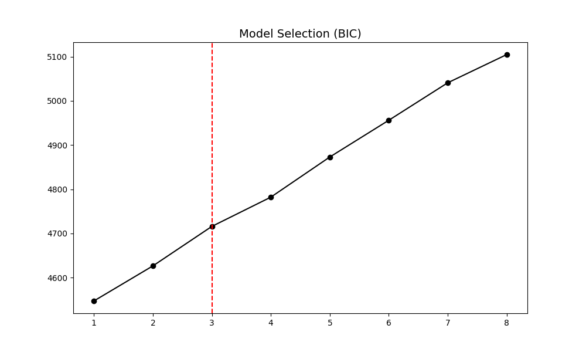
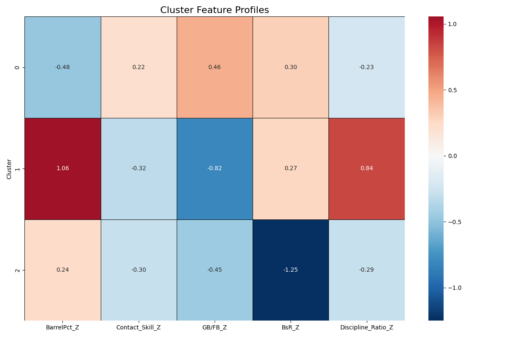
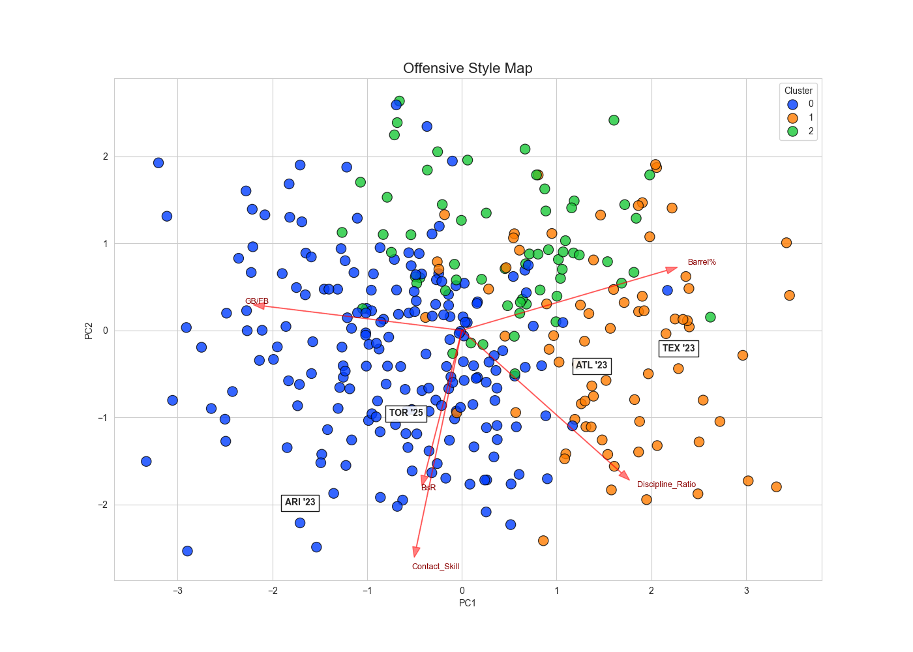
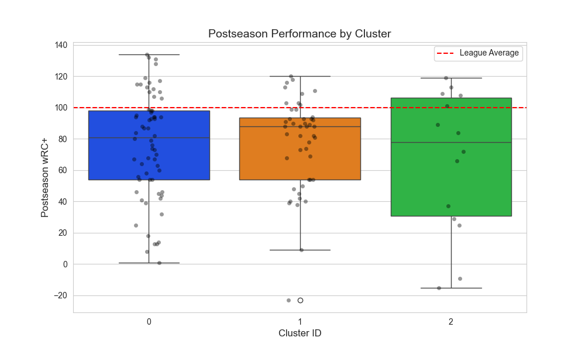

# MLB Offensive Archetypes Analysis

Identifying distinct offensive styles in Major League Baseball using unsupervised clustering

## Overview

This project evaluates offensive team roster construction philosophies from both results and peripheral metrics. Using unsupervised learning, it identifies distinct offensive archetypes that may perform differently across contexts, rather than relying solely on aggregate stats like wRC+ or OPS.

## Methodology

### Data Sources
- **FanGraphs**: Regular season and postseason team statistics
- **Time Period**: 2015-2025

### Feature Engineering

Five core features normalized by season (z-scores):

| Feature | Description |
|---------|-------------|
| BarrelPct_Z | Barrel rate (hard contact) |
| Contact_Skill_Z | Contact ability (1 - Strikeout Rate) |
| GB/FB_Z | Ground ball to fly ball ratio |
| BsR_Z | Base running value |
| Discipline_Ratio_Z | Plate discipline (Z-Swing% / O-Swing%) |

### Clustering Approach

- **Algorithm**: Gaussian Mixture Model (GMM) with full covariance matrices
- **Model Selection**: Bayesian Information Criterion (BIC)
- **Initialization**: 10 random starts, fixed seed (random_state=42)
- **Validation**: Postseason performance by cluster

## Results

### Model Selection



### Cluster Profiles



### Offensive Style Map



### Postseason Validation



### Top Performers by Archetype

| Archetype | Team | Season | wRC+ | Barrel (σ) | Speed (σ) | Contact (σ) |
|-----------|------|--------|------|------------|-----------|--------------|
| **Speed/Contact** | HOU | 2019 | 124 | -0.5 | -0.4 | +2.4 |
| | NYM | 2020 | 123 | -0.1 | -0.3 | +0.8 |
| | HOU | 2017 | 121 | -0.3 | -0.0 | +2.1 |
| | TOR | 2022 | 118 | +0.7 | -0.3 | +1.2 |
| | TBR | 2023 | 117 | +0.2 | +0.7 | -0.1 |
| **Power** | ATL | 2023 | 126 | +2.9 | +1.0 | +1.1 |
| | LAD | 2020 | 120 | +2.1 | -0.3 | +1.5 |
| | ATL | 2020 | 120 | +2.1 | +0.6 | -0.5 |
| | NYY | 2025 | 119 | +2.7 | -0.7 | -0.6 |
| | LAD | 2022 | 119 | +1.3 | +1.0 | +0.2 |
| **Balanced** | MIN | 2019 | 116 | +2.5 | -1.3 | +1.0 |
| | BAL | 2024 | 114 | +1.0 | -0.0 | +0.3 |
| | NYY | 2022 | 114 | +1.9 | -0.7 | -0.0 |
| | SEA | 2025 | 113 | +0.8 | -0.5 | -0.5 |
| | SFG | 2020 | 112 | +0.5 | -1.1 | +0.7 |

## Usage

### Prerequisites
```bash
pip install -r requirements.txt
```

### Running the Analysis
```bash
python src/v2_fangraphs_model/01_prepare_data.py
python src/v2_fangraphs_model/02_run_analysis.py
python src/v2_fangraphs_model/03_generate_rosters.py
```

## Technologies

Python, pandas, numpy, scikit-learn, matplotlib, seaborn, pybaseball

