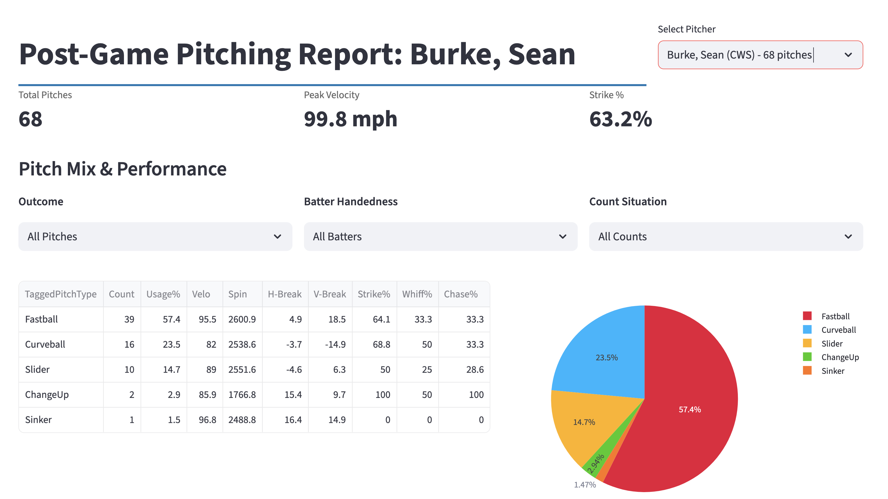
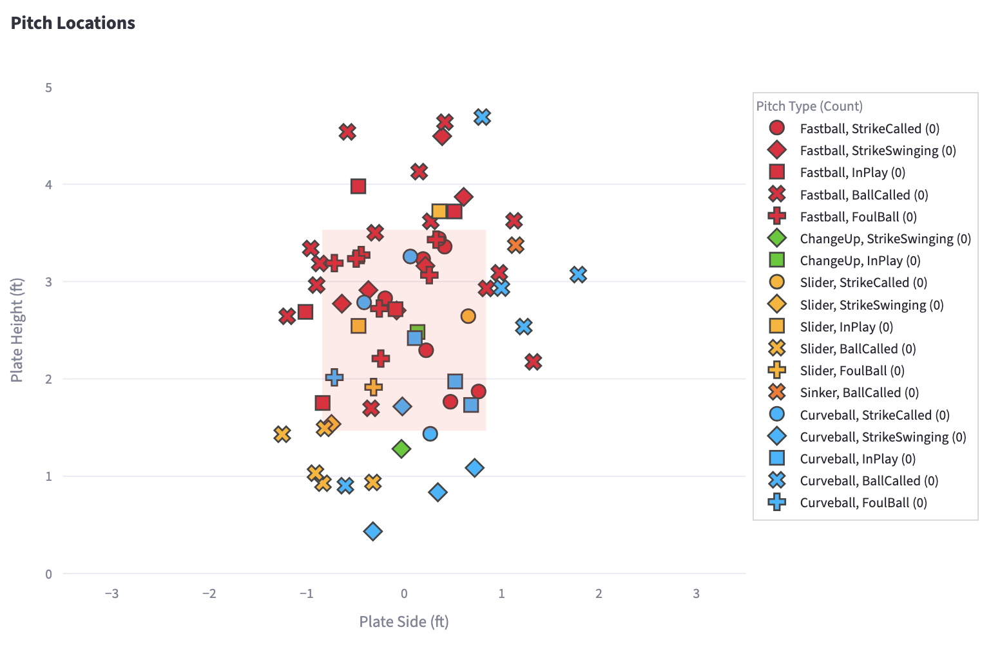
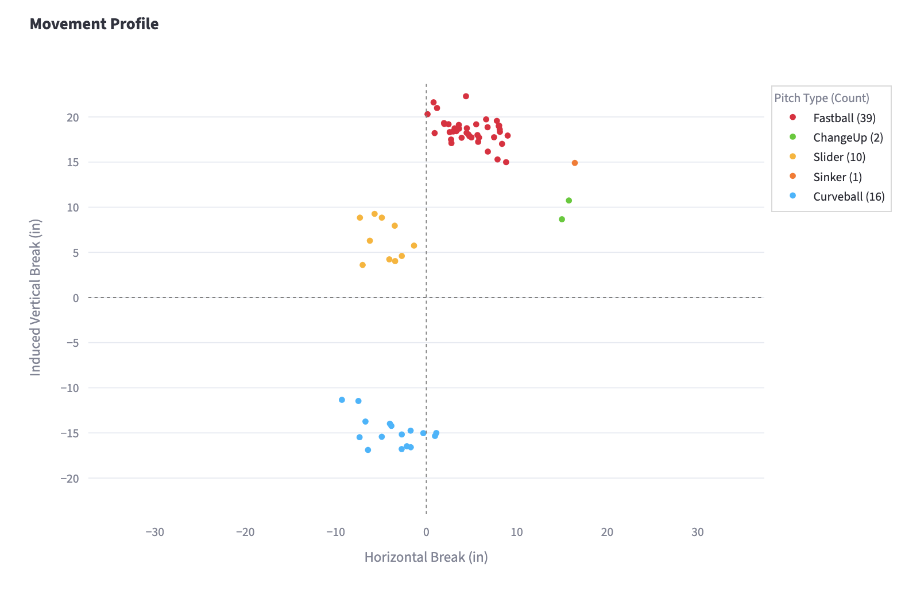
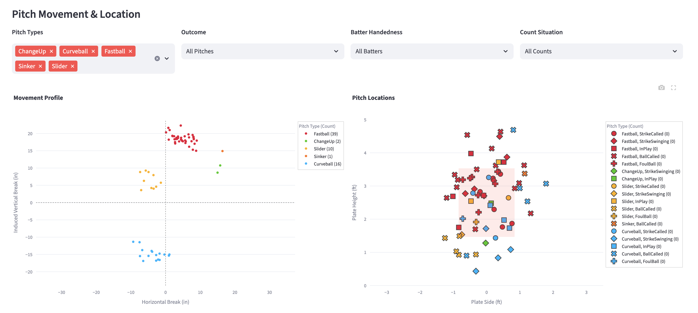

# Post-Game Pitching Analysis App

Generate a complete post-game pitching report from raw pitch tracking data in seconds.

---

## Overview

Analyzing pitcher performance from pitch-tracking data is typically a manual and time-consuming workflow. This project transforms raw CSV pitch data into an interactive scouting report that allows coaches and analysts to quickly evaluate a pitcher’s performance from a single game.

The application converts pitch-level data into pitch mix summaries, movement profiles, strike zone visualizations, and advanced plate discipline metrics.

---

## Features

- Pitch mix and usage percentage breakdown  
- Pitch movement visualization (horizontal vs vertical break)  
- Pitch location plots with strike zone overlay  
- Interactive filtering by outcome, batter handedness, and count  
- Automatic calculation of swings, whiffs, strikes, and chases  
- Fast and interactive dashboard built with Streamlit  

---

## Example Dashboard

### Performance Breakdown


### Pitch Location Plot


### Movement Profile


### Interactive Filters


---

## Technical Highlights

### Robust Data Ingestion
The app handles messy real-world CSV exports by attempting multiple encodings and filtering unusable records.

### Derived Baseball Metrics
Swing, whiff, strike, and chase metrics are programmatically derived from pitch-level event data.

### Interactive Visualization
Plotly dashboards provide consistent axis ranges and hover interactions for deeper exploration.

### Product-Oriented Architecture
The project separates data processing and UI logic into modular components and uses caching to improve performance.

---

## Running Locally

Install dependencies:

```bash
pip install streamlit pandas numpy plotly
